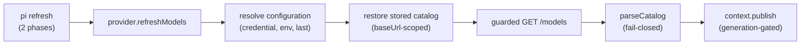

# Contributing to pi-actualyze

This document covers the development workflow, the architecture of the
provider, and the invariants that must not regress.

## Prerequisites

- Node.js 22.19.0 or newer (CI runs 22 and 24)
- npm (ships with Node)
- A [pi](https://github.com/earendil-works/pi) checkout or installation of
  0.84.2 or newer if you want to exercise the extension end to end

## Setup

```bash
git clone git@github.com:actualyze-ai/pi-actualyze.git
cd pi-actualyze
npm install
npm run check
```

`npm install` also installs the git hooks (husky). `npm run check` runs the
complete offline gate: typecheck, lint, format check, tests, build, and a
dry-run pack inspection. It must pass before any push.

To load your checkout in pi without touching your pi settings:

```bash
pi --no-extensions -e .
```

## Development workflow

| Where                           | What runs                                                                        |
| ------------------------------- | -------------------------------------------------------------------------------- |
| `pre-commit` hook               | Biome lint/format on staged files (lint-staged)                                  |
| `pre-push` hook                 | `npm run check`                                                                  |
| CI (`.github/workflows/ci.yml`) | `npm ci` + `npm run check` on pushes to `main` and pull requests, Node 22 and 24 |
| Never automatically             | Live tests (`npm run test:live`), which spend real credentials and money         |

## Architecture

The package registers one dynamic `Provider<"openai-completions">` with pi.
Six small modules under `src/`:

| Module         | Responsibility                                               |
| -------------- | ------------------------------------------------------------ |
| `constants.ts` | Provider ID, env var names, sentinel limits, budgets         |
| `endpoint.ts`  | Target-label validation and canonical base URL construction  |
| `transport.ts` | Guarded fetch, retries, deadlines, bounded reads, redaction  |
| `catalog.ts`   | Fail-closed `/models` parsing and model conversion           |
| `client.ts`    | Thin composition: guarded fetch + `getJson` + `parseCatalog` |
| `provider.ts`  | Auth hooks, refresh lifecycle, catalog state, stream guards  |
| `index.ts`     | Extension entry point: `pi.registerProvider(...)`            |

Data flow for a catalog refresh:



Key behaviors, each backed by tests:

- **Endpoint validation** (`endpoint.ts`): the target is exactly one ASCII
  DNS label. The base URL is always
  `https://<target>.actualyze.ai/openai/v1`. Test-only endpoints are
  injected through options, never through relaxed validation.
- **Guarded transport** (`transport.ts`): every request, including
  inference, goes through a fetch wrapper that requires HTTPS, the exact
  configured origin, and paths under `/openai/v1`; rejects all redirects
  (301/302/303/307/308); and redacts the API key and authorization header
  from every error path, including provider error bodies and headers.
- **Fail-closed catalog** (`catalog.ts`): one malformed, duplicate, or
  unsafe entry rejects the whole generation. The previous generation stays
  intact. There is no partial publication.
- **Sentinels, not guesses**: missing limits become documented pi schema
  fallbacks (128,000 context / 16,384 output). All costs are `0`, an
  unknown-price sentinel, until Actualyze confirms currency and units.
  PDF/audio/video advertisements are not mapped to pi modalities.
- **Target-scoped cache** (`provider.ts`): a persisted catalog is restored
  only when every model's `baseUrl` matches the currently resolved target.
  Mismatches are discarded, not displayed.
- **Stream guards** (`provider.ts`): before dispatch, a request is refused
  when the catalog attributes the model ID to another target, when the
  model object's base URL does not match the active target, or when the ID
  is absent from a non-empty discovered catalog.

## Subtleties worth knowing before you edit `provider.ts`

These took several review rounds to get right. Understand them before
changing the refresh or auth code.

**pi refreshes in two phases.** Phase 1 is cache-only and runs with the
_stored_ credential, which is `undefined` for users configured purely via
environment variables. Phase 2 resolves auth (calling the provider's
`resolve()`) and allows network. `refreshConfiguration` therefore resolves
field by field: stored credential first, then `process.env`, then the last
resolved configuration. Without the env fallback, ambient-only users would
never restore a cached catalog offline.

**`check()` must never throw.** pi runs every provider's availability check
in one `Promise.all`; a single throwing `check()` blanks the model picker
for all providers. Validation errors from stored credentials are caught in
`check()` and surfaced later through `resolve()`, which fails only the
request that needs the credential.

**pi rewrites `model.baseUrl` before calling `stream()`.** The runtime
replaces the model's base URL with the resolved auth URL, so a naive
`model.baseUrl !== activeBaseUrl` comparison can never fire through the
real pipeline. The catalog-attribution check (look up the ID in the
in-memory catalog) is the guard that actually works; the direct comparison
is kept for direct provider use only.

**`pendingLoginCatalog` is cleared only by a matching publish.** Login
installs the fetched catalog in memory and stages it for persistence. A
refresh holding a stale credential can still be in flight when login
completes, and pi does not supersede it until the post-login credential
sync. If the mismatch path cleared the pending catalog, that stale refresh
could destroy a fresh login's catalog. Instead, mismatched refreshes fall
through and publish whatever is correct for their configuration, and the
pending catalog survives until a refresh with the matching credential
consumes it. The tradeoff: after a genuine target switch the pending entry
is retained as dead weight, and if auth later returns to the exact pending
target and key without a new login, the login-time snapshot is republished
once before the next network refresh replaces it.

**Generation gating is the concurrency backbone.** `context.publish()`
runs its `update` callback only when the calling refresh is still the
current generation. Any state change that must not be applied by a
superseded refresh belongs inside `update`, not before the publish call.

## Caveats

- **`--list-models` race (pi 0.84.2).** The CLI's availability lookup can
  run before the asynchronous refresh triggered by extension registration
  completes, printing no dynamic models. Interactive `/model` is reliable.
- **Costs are always zero.** This is an unknown-price sentinel, not free
  inference. Actualyze advertises `cost.input`, `cost.output`,
  `cost.cache_read`, and `cost.cache_write`, but the API response does not
  declare currency or units, and pi interprets cost fields as USD per
  million tokens. Once Actualyze confirms the units, promote the mapping
  (`input`→`input`, `output`→`output`, `cache_read`→`cacheRead`,
  `cache_write`→`cacheWrite`) in one tested change; promoted values must
  be finite and non-negative, and a missing rate stays zero.
- **Advisory capability flags.** `streaming: false` and `tool_use: false`
  in the Actualyze catalog are advisory; a sampled `streaming: false` model
  streamed successfully. Models are never filtered on these flags.
- **`models.json` entries are not supported.** Manually defined Actualyze
  models are refused by the stream guard because the provider's discovered
  catalog is authoritative.
- **The prepare script tolerates a missing husky.** `pi install git:...`
  runs `npm install --omit=dev` in the clone, which still executes
  `prepare`. The script swallows only `ERR_MODULE_NOT_FOUND` so hook
  installation is skipped in production installs but real failures still
  surface.

## Code style

- TypeScript strict mode; no `any`.
- Biome for lint and formatting (`biome.json`); tabs, 120-column lines.
- `npm run format` fixes formatting; `npm run lint` checks lint rules.

## Testing

```bash
npm test            # offline suite (excludes test/live.test.ts)
npm run test:live   # explicit, credential-gated live tests
```

Tests derive from decision logic and error paths, not coverage targets.
`test/models-lifecycle.test.ts` drives pi's real `ModelRuntime` rather than
hand-rolled contexts; prefer that pattern for lifecycle behavior, because
several bugs (auth rewrite bypassing the stream guard, two-phase refresh
ordering) were only reachable through the real runtime. The offline suite
must stay hermetic: `test/setup.ts` clears ambient `ACTUALYZE_*` variables
so a developer's exported live credentials cannot leak into assertions.

Security-sensitive paths have dedicated tests: redirect blocking with
proof that no second request carries credentials, redaction of keys from
every error path, a secret scan of the packed artifact, and hostile
catalog inputs (control characters, dot segments, oversized and
non-encodable IDs).

## Commit messages

Conventional Commits: `<type>(scope): <summary>` with an imperative,
specific summary and no trailing period. Add a body with bullet points when
the summary alone is ambiguous; wrap body lines at 72 characters.

## Pull requests

- `npm run check` must pass locally (the pre-push hook enforces this) and
  in CI on both Node versions.
- Changes to the refresh lifecycle, auth hooks, transport guards, or
  catalog validation need tests that fail without the change.
- Never include credentials, live API captures, or `.env` files. The pack
  test scans the published file list for secret-shaped content, but that is
  a backstop, not permission.
- Public contract changes (exported symbols, CLI-visible behavior,
  configuration) must update the README and this guide.
